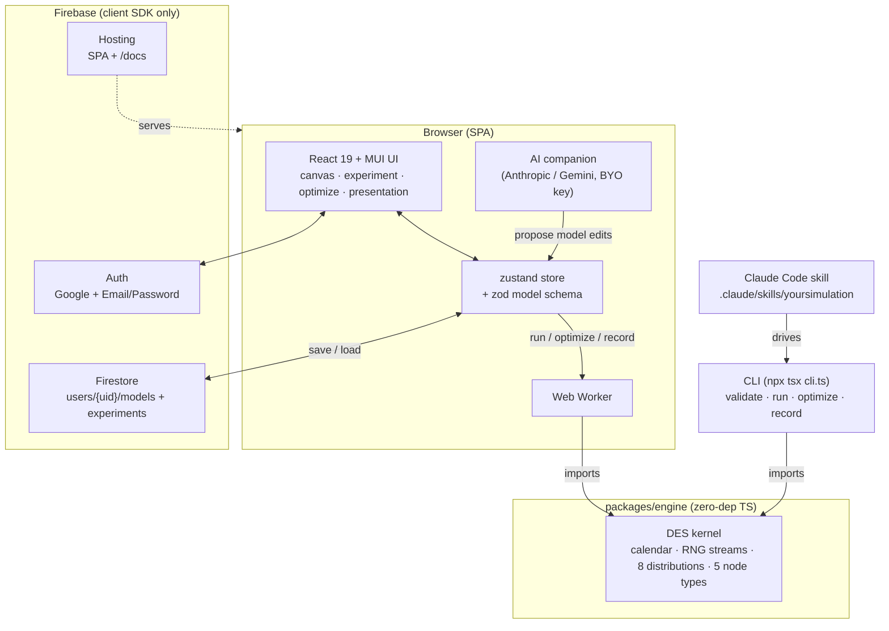

# Architecture

YourSimulation is a **client-only** application: a zero-dependency simulation
engine plus a React single-page app, with Firebase providing hosting, auth, and
storage. There is no custom backend — everything runs in the browser (or in
Node, for the CLI).

## System map



## Components

### `packages/engine` — the simulation kernel

A **zero-dependency** TypeScript discrete-event simulation (DES) engine with no
DOM or Node-specific APIs, so the exact same code runs in the browser worker, in
Node (CLI and tests), and in any other JS host. It provides:

- an **event calendar** (priority queue of scheduled events),
- **seeded RNG streams** — each node gets its own deterministic stream, so runs
  are reproducible and replications are independent ([why this matters](/theory/01-discrete-event-simulation)),
- **8 distributions** for inter-arrival and service times ([reference](/theory/03-distributions)),
- the **5 node types** — `source`, `queue`, `resource`, `branch`, `sink`,
- and the top-level entry points `buildSimulation`, `runExperiment`,
  `recordRun`, and `optimize`.

See the [engine README](https://github.com/dagangilat/yoursimulation/blob/main/packages/engine/README.md)
for the public API.

### `apps/web` — the React SPA

React 19 + Vite + MUI + zustand + zod. The real `src/` layout:

| Folder | Responsibility |
| --- | --- |
| `canvas/` | React Flow drag-and-drop model editor |
| `model/` | zod model schema, types, starter model |
| `store/` | zustand application state |
| `panel/` | property panels for selected nodes |
| `experiment/` | run settings + KPI dashboard (mean ± 95% CI) |
| `optimize/` | Cross-Entropy optimizer tab |
| `presentation/` | watch-mode animated playback + domain themes |
| `companion/` | provider-neutral AI agent |
| `charts/` | SVG charts (histograms, time series) |
| `validation/` | live model validation (zod + engine dry build) |
| `persistence/` | localStorage autosave + JSON import/export |
| `firebase/` | auth, Firestore models/experiments, config |
| `theme/`, `theme.ts` | light/dark token theme |

### Web Worker

The engine runs **off the main thread** in a Vite-native Web Worker via an
injectable worker factory, with cancelable client wrappers. Long
`runExperiment`/`optimize` jobs report progress and can be canceled without
freezing the UI.

### Firebase (client-only, no backend)

- **Hosting** serves the SPA and these docs (mounted at `/docs`).
- **Firestore** stores models under `users/{uid}/models` with an `experiments`
  subcollection.
- **Auth** supports Google and Email/Password sign-in.

There are **no Cloud Functions and no backend** — this is a deliberate
non-goal. The simulation is pure client compute, and the AI companion uses a
**bring-your-own-key** model (the user's API key lives in `localStorage` and
calls the provider directly), so there is no server that needs to hold secrets,
proxy LLM traffic, or run simulations. Firebase config (`apps/web/src/firebase/config.ts`)
holds only **public client keys**, which is expected for a Firebase web app.

### CLI

`packages/engine/src/cli.ts`, run via `npx tsx`. JSON in, JSON out:

```bash
npx tsx packages/engine/src/cli.ts run docs/examples/mm1.json --pretty
```

Commands: `validate`, `run`, `optimize`, `record`. See the [tutorial](/tutorial).

### Claude Code skill

`.claude/skills/yoursimulation/` teaches Claude Code to model, run, and optimize
systems over the engine CLI. See the
[skill](https://github.com/dagangilat/yoursimulation/blob/main/.claude/skills/yoursimulation/SKILL.md)
and its [model schema reference](https://github.com/dagangilat/yoursimulation/blob/main/.claude/skills/yoursimulation/references/model-schema.md).

### AI companion

`apps/web/src/companion/` is a **provider-neutral**, tool-using agent that works
with both Anthropic and Gemini. The user supplies their own API key (stored in
`localStorage`). The companion proposes model edits that the user reviews and
**applies** into the zustand store.

## Data flow

1. **Edit** — the user builds a model on the canvas; edits flow into the zustand
   store and are continuously validated against the zod schema (and an engine
   dry build).
2. **Run** — the store ships the model + run settings to the Web Worker, which
   imports the engine and executes seeded replications.
3. **Results** — KPIs (mean ± 95% CI), percentiles, histograms, and time series
   come back to the dashboard and SVG charts.
4. **Persist** — models and saved experiments can be stored to Firestore;
   otherwise everything is kept in `localStorage`.

## See also

- [Development timeline](/development-timeline) — how the pieces were built.
- [Discrete-event simulation](/theory/01-discrete-event-simulation),
  [Queueing theory](/theory/02-queueing-theory),
  [Cross-Entropy optimization](/theory/04-cross-entropy).
