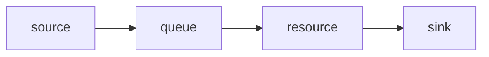

# Discrete-event simulation

Some questions about a service system have clean closed-form answers — for a textbook M/M/1 queue you can read the mean wait straight off a formula. But the moment the model gets realistic (general service-time distributions, finite buffers, priority disciplines, branching, multiple resource pools) the formulas run out. Simulation keeps working where the math stops: you describe the system, draw random samples, and *measure* the behaviour. The [queueing theory page](/theory/02-queueing-theory) shows how YourSimulation's simulated numbers line up with the formulas in the cases where both apply — that agreement is what gives you confidence in the cases where only simulation applies.

## What "discrete-event" means

In YourSimulation, **entities** (customers, passengers, packets — whatever flows) move through a small graph of **nodes**:



The five node types are:

- **source** — creates entities, spacing arrivals by an interarrival [distribution](/theory/03-distributions).
- **queue** — holds entities waiting for a resource (FIFO by default).
- **resource** — a pool of `servers`; each busy server holds one entity for a sampled service time.
- **branch** — routes an entity down one of several outgoing edges by probability.
- **sink** — absorbs finished entities and records time-in-system.

The "discrete-event" part is about *how time advances*. The simulator does **not** tick forward in fixed steps. Nothing happens between an arrival at $t=4.12$ and the next departure at $t=9.87$, so the clock simply **jumps** from one scheduled event to the next. Each event (an arrival, a service completion) may schedule future events, and the clock always advances to the nearest pending one. This is exact and cheap — a model can simulate days of activity in milliseconds because it only does work when something actually happens.

## The event calendar

Pending events live in a min-heap **event calendar** ([`calendar.ts`](https://github.com/dagangilat/yoursimulation-core/blob/main/packages/engine/src/calendar.ts)) ordered by `(time, seq)`. The `time` key drives the clock; the insertion-order `seq` breaks ties deterministically (FIFO among events scheduled for the same instant). The main loop is just: pop the earliest event, advance the clock to its time, run its callback (which may schedule more events), repeat until the horizon is reached.

## Seeded RNG streams

Reproducibility comes from a small seeded PRNG (`Random`, Mulberry32) in [`random.ts`](https://github.com/dagangilat/yoursimulation-core/blob/main/packages/engine/src/random.ts). The same seed always produces the same run.

The important refinement is **independent streams**. Rather than drawing every random number from one global generator, each stochastic concern derives its own stream via `streamSeed(root, streamId)`. This means editing one node (say, adding a server) does **not** shift the random draws feeding every *other* node — a property called common random numbers. Scenario comparisons stay fair, and replications stay independent of one another.

## Warm-up

A simulation started from an empty system is not representative of steady state — early entities see no queue. To remove this **initialization bias**, statistics collected before `settings.warmup` are discarded: the engine runs to `warmup`, calls `resetStats()`, then runs on to `horizon` collecting the numbers that count ([`experiment.ts`](https://github.com/dagangilat/yoursimulation-core/blob/main/packages/engine/src/experiment.ts)).

## Replications and confidence intervals

One run is one random sample of a noisy process — its average could be lucky or unlucky. So the engine performs `settings.replications` **independent** runs, each with its own derived seed (`streamSeed(seed, "rep-r")`), and averages the per-replication metrics.

Because we have several independent estimates of each metric, we can quantify uncertainty. Every metric is reported as a `mean` plus `ci95`, the **95% confidence-interval half-width** across replications using the normal approximation:

$$\text{ci95} = 1.96 \cdot \frac{s}{\sqrt{n}}$$

where $s$ is the sample standard deviation across the $n$ replications. Read `mean ± ci95` as: the true steady-state value is, with ~95% confidence, in that band. Narrower bands mean a longer `horizon` or more `replications`.

## Settings recap

```jsonc
"settings": {
  "horizon": 20000,      // total model-time per replication (incl. warm-up)
  "warmup": 2000,        // discard stats before this time
  "replications": 20,    // independent runs to average
  "seed": 42             // root seed for all derived streams
}
```

Next: [queueing theory](/theory/02-queueing-theory), where these mechanics are validated against the M/M/1 and M/M/c formulas.
