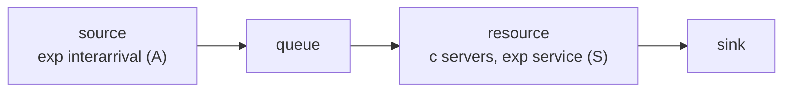

# Queueing theory (M/M/1 & M/M/c)

Queueing theory gives exact formulas for a handful of idealized systems. YourSimulation reproduces those systems as small node graphs, and its simulated numbers match the formulas — which is exactly why you can trust it on the messier systems that have no formula. This page maps the theory onto the engine and shows the validation.

## Kendall notation

A queue is summarized as **`A/S/c`**:

- **A** — the arrival process (interarrival-time distribution).
- **S** — the service-time distribution.
- **c** — the number of parallel servers.

`M` means *Markovian* — exponential (memoryless) times. So **M/M/1** is exponential arrivals, exponential service, one server; **M/M/c** is the same with `c` servers sharing one queue.

## Mapping onto YourSimulation

An `A/S/c` queue is a four-node chain:



- arrival rate $\lambda = 1 / \text{interarrival mean}$
- per-server service rate $\mu = 1 / \text{service mean}$
- `servers` on the resource is $c$

## Key formulas

**Utilization** — the fraction of server capacity in use:

$$\rho = \frac{\lambda}{c\mu}$$

The system is **stable** (queue does not grow without bound) iff $\rho < 1$. See [utilization](/glossary#utilization).

**M/M/1** — mean wait in queue and mean queue length:

$$W_q = \frac{\rho}{\mu - \lambda}, \qquad L_q = \lambda W_q$$

($L_q = \lambda W_q$ is Little's law: the average number waiting equals the arrival rate times the average wait.)

**M/M/c** — with $c$ servers the wait depends on the **Erlang-C** probability that an arriving entity finds all servers busy, $C(c, \lambda/\mu)$:

$$W_q = \frac{C(c,\, \lambda/\mu)}{c\mu - \lambda}$$

The Erlang-C formula itself is standard; the docs don't re-derive it. (The validation suite computes it directly to check the engine — see [`validation.test.ts`](https://github.com/dagangilat/yoursimulation/blob/main/packages/engine/test/validation.test.ts).)

## Validation

These checks live in [`packages/engine/test/validation.test.ts`](https://github.com/dagangilat/yoursimulation/blob/main/packages/engine/test/validation.test.ts) and run on every commit, asserting the engine matches theory within tolerance (utilization to ±0.03, waits to ±10%). The "Engine" column below is the actual simulator output (`mean ± ci95`):

| System | Metric | Theory | Engine (mean ± CI) |
|---|---|---|---|
| M/M/1, λ=0.1, μ=0.125 (ρ=0.8) | utilization | 0.800 | 0.794 ± 0.011 |
| M/M/1, λ=0.1, μ=0.125 (ρ=0.8) | $W_q$ | 32.0 | 30.80 ± 3.04 |
| M/M/1, λ=0.1, μ=0.125 (ρ=0.8) | $L_q$ | 3.2 | 3.07 ± 0.32 |
| M/M/3, λ=1, mean svc 2.4 (ρ=0.8) | $W_q$ | ≈2.589 (Erlang-C) | 2.60 ± 0.10 |

The M/M/1 figures come from `docs/examples/mm1.json`; the M/M/3 figure from an equivalent 3-server model. Every theory value sits inside the engine's confidence band. (Note: the `mm1.json` example uses a shorter `horizon`/fewer replications than the validation suite, so its CI is wider — the test suite uses a longer run to assert the ±10% bound reliably.)

## Try it

```bash
npx tsx packages/engine/src/cli.ts run docs/examples/mm1.json --pretty
# utilization ≈ 0.8 on "svc"; avgWait ≈ 32 on "q"
```

## Where to go next

- [Distributions](/theory/03-distributions) — replace exponential service with realistic shapes (the "M" stops applying, the simulation keeps working).
- [Discrete-event simulation](/theory/01-discrete-event-simulation) — how the engine actually computes these numbers.
- [Glossary](/glossary) — definitions of utilization, throughput, and more.
